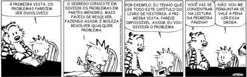

# Introdução
&emsp;&emsp;Nesse topico abordaremos o algoritmo "Dividir para Conquitar", a solução para esse algoritimo consiste nos seguintes passos.

   * Passo 1: O problema dado é dividido em pequenos problemas.
   * Passo 2: Cada pequeno problema é resolvida separadamente.(Nesse segundo passo normalmente ultizamos chamadas recussivas que é  parte da conquita)
   * Passo 3: As soluções do problemas menores são combinadas para assim produzir uma solução mais robusta.

&emsp;&emsp;Logo abaixo podemos ver algumas imagens inlustrativas

  

 [Calvin discutindo sobre o algoritimo](./images/calvin.jpg) 

# Questão Problema

## Entendimento do problema

Esse é um dos problemas classicos da matematicos que é possivel se aplicar o algoritimos de dividir para conquitar, esse problema foi incentado em 1883 pelo matemático franceês Edouard Lucas. Esse problema tem uma inspiração direta com um lenda hindu,

## Conflito cognitivo

## Resolução

<audio controls>
  <source src="https://github.com/projeto-de-algoritmos/D-C-Apre-DC/blob/master/assets/audios/teste1.m4a?raw=true" type="audio/mpeg">
</audio>

